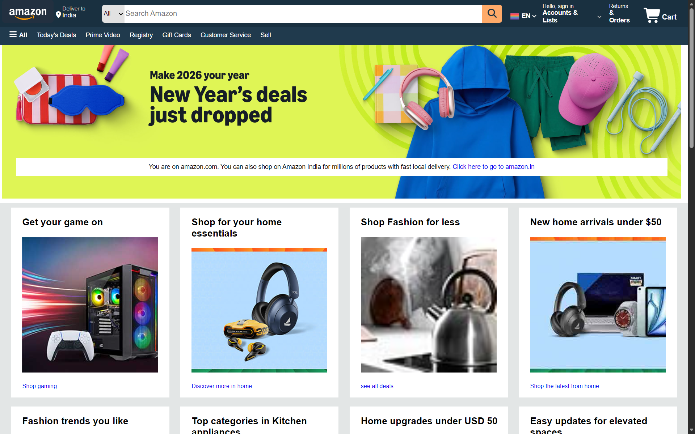

# Amazon UI Clone 

This is a front-end clone of the Amazon homepage created using HTML and CSS.

## 📌 About
I built this project at the beginning of my web development journey while learning basic concepts of HTML and CSS.  
It was not uploaded earlier, so I am adding it now as part of my learning record.

## 🚀 Features
-Amazon-like navigation bar
-Search bar UI
-Product sections layout
-Responsive design basics
## 🛠️ Tech Used
-HTML
-CSS
## 📂 How to Run
1. Download or clone the repository
2. Open `amazon.html` in your browser

## 📸 Preview

## 📚 Learning Purpose
This project is a practice project and does not have any backend or real functionality.

